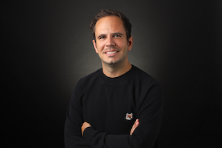

## Profile

<table align="left">
  <tr>
    <td>Constantin Hoferer, LL.M. (London) - Fully Qualified Lawyer</td><td rowspan="2"></td>
  </tr>
  <tr>
    <td>Constantin is a fully qualified lawyer and expert in Intellectual Property Law. I am currently based in Germany.</td>
  </tr>
</table>

<h3 style="margin-top:0.83em">Professional Experience</h3>

<table align="left">
  <tr><td>&#8226;</td><td><i>2019 - today</i></td><td>Legal Counsel for Open Source Software</td><td>Daimler AG</td></tr>
  <tr><td>&#8226;</td><td><i>2016 - 2018</i></td><td>Junior Legal Counsel for Global Innovation</td><td>adidas AG</td></tr>
</table>

<h3 margin="10">Training Contract/Legal Clerkship</h3>

<table align="left">
  <tr><td>&#8226;</td><td><i>2019</i></td><td>Permanent Mission of the Federal Republic of Germany to the United Nations in New York</td></tr>
  <tr><td>&#8226;</td><td><i>2018</i></td><td>THEOPARK Rechtsanwälte und Steuerberater Partnerschaft mbB, lawyers and tax advisors (corporate law)</td></tr>
  <tr><td>&#8226;</td><td><i>2018</i></td><td>Luftamt Nordbayern, civil aviation authority</td></tr>
  <tr><td>&#8226;</td><td><i>2017</i></td><td>Staatsanwaltschaft Nürnberg-Fürth, public prosecutors, chamber of commercial crime</td></tr>
  <tr><td>&#8226;</td><td><i>2017</i></td><td>Landgericht Nürnberg-Fürth, civil law chamber at the district court of Nuremberg-Fuerth</td></tr>  
</table>

<h3 margin="10">Qualification/Academic Record</h3>

<table align="left">
  <tr><td>&#8226;</td><td><i>2020</i></td><td>MBA Essentials at London School of Economics and Political Science (online certified)</td></tr>
  <tr><td>&#8226;</td><td><i>2019</i></td><td>Fully Qualified German Lawyer, second state examination</td></tr>
  <tr><td>&#8226;</td><td><i>2016</i></td><td>LL.M. in Intellectual Property law at Queen Mary University of London</td></tr>
  <tr><td>&#8226;</td><td><i>2015</i></td><td>German Diploma Lawyer at Freie Universität Berlin, first state examination</td></tr>
</table>

    

This page is currently used to try out GitHub Pages and experiment to get a better understanding of code collaboration via GitHub and underlying principles.

---

<i>Privacy:</i>   
The creator of this schonauchgut GitHub Page, does not collect any of your data himself. GitHub Inc. does however collect data when accessing this page and states: _Please note that GitHub may collect User Personal Information from visitors to your GitHub Pages website, including logs of visitor IP addresses, to comply with legal obligations, and to maintain the security and integrity of the Website and the Service. [GitHub Privacy statement for further information.](https://docs.github.com/en/free-pro-team@latest/github/site-policy/github-privacy-statement)_

